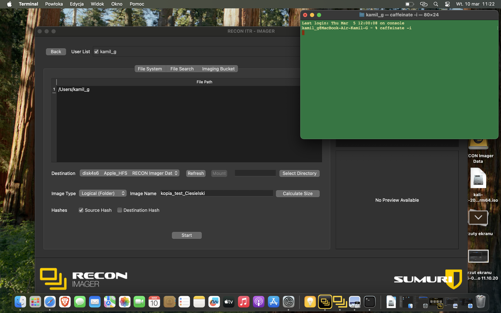
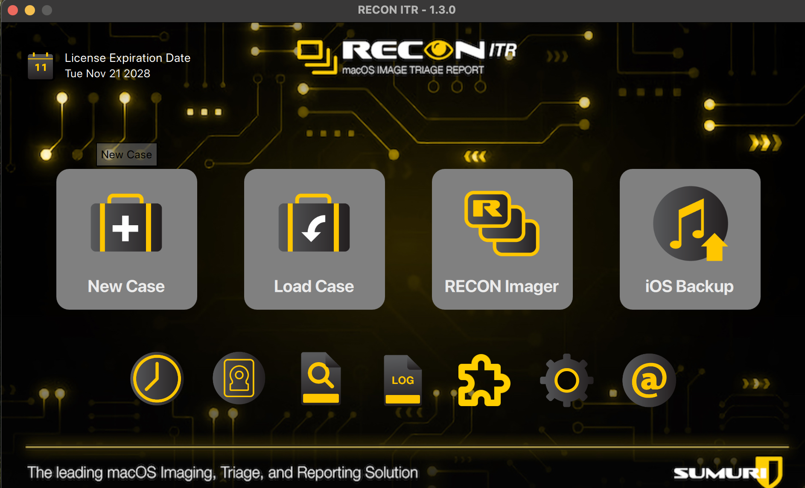
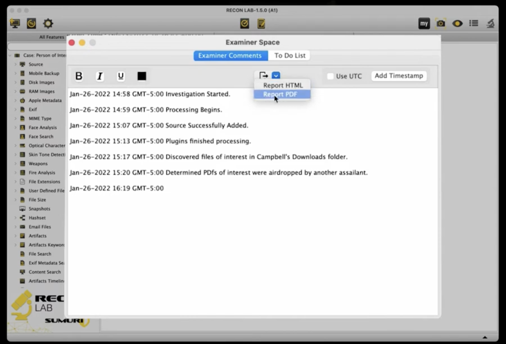
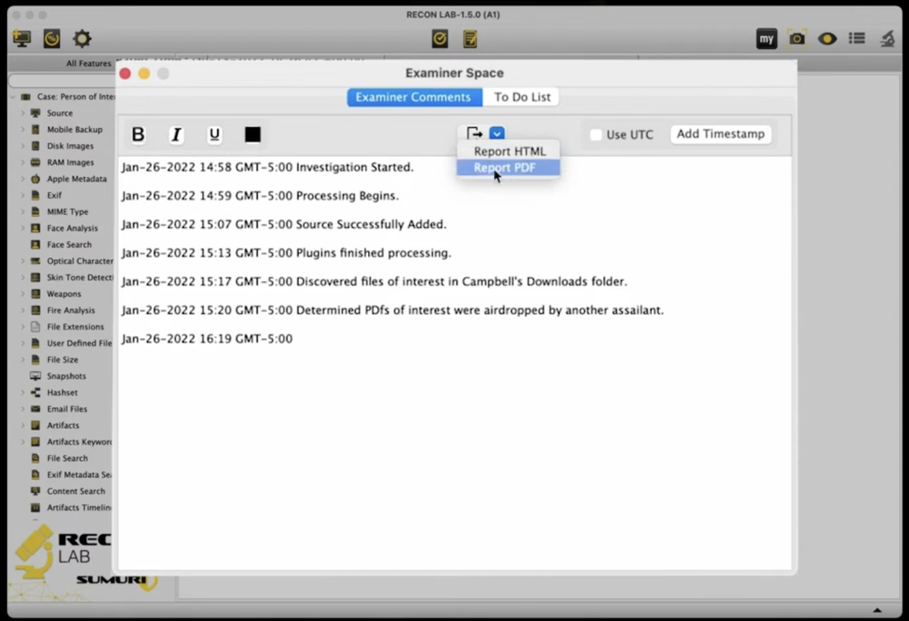
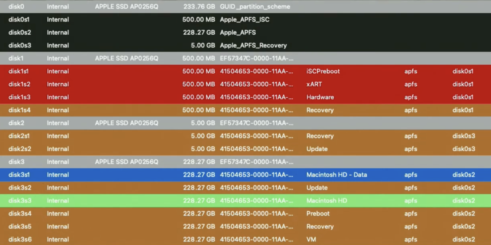
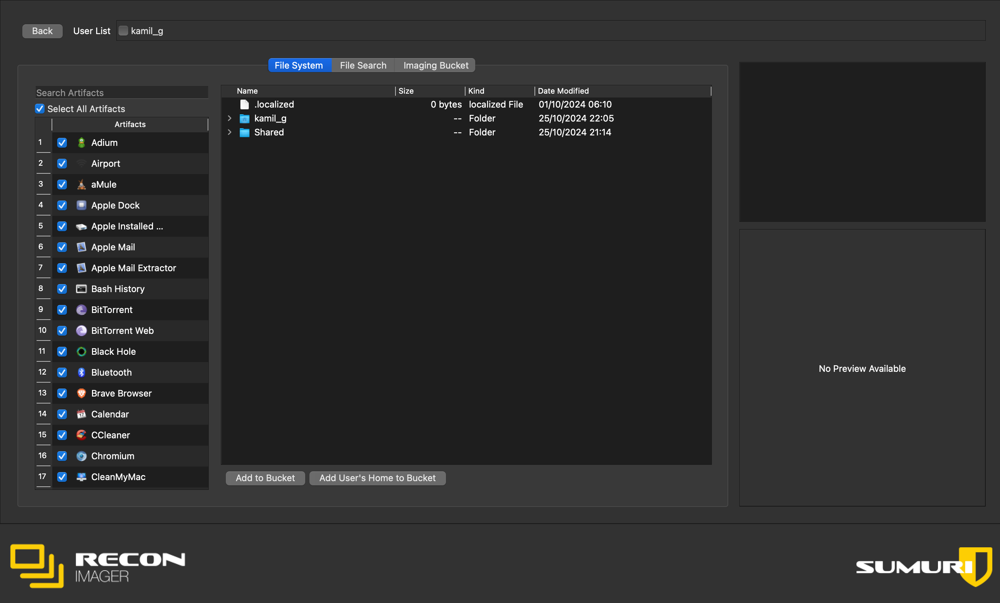
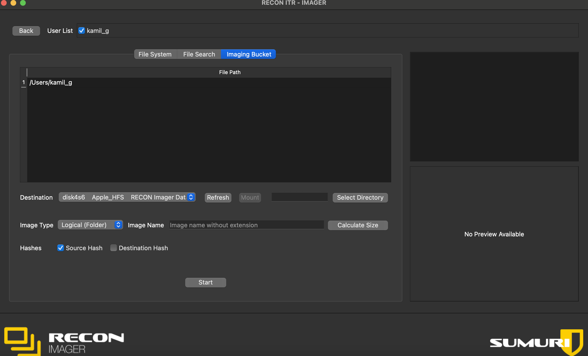
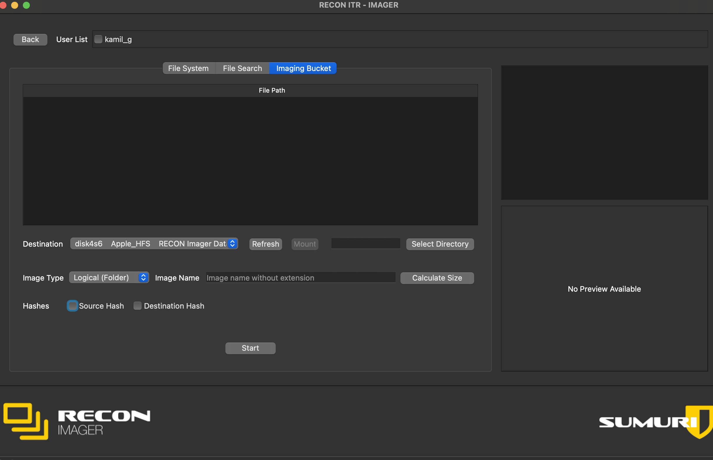

# 🍏 Silicon-Sustain-Live-Forensics
### RECON ITR Acquisition: Zero-Password Live Triage for Apple Silicon

**Project Description:** Maintaining system access and performing logical imaging on unlocked M1/M2 Macs when the administrator password is unknown.

---

## 🛑 Phase 1: Immediate Session Preservation
The absolute priority is to prevent the Mac from sleeping or locking.

1.  **Open Terminal** and execute: `caffeinate -d`
2.  **Monitor:** Keep the Terminal window visible.

---

## 🛠️ Phase 2: RECON ITR Initialization
1.  **Connect** your RECON ITR 1TB drive.
2.  **Launch** and select **"New Case"**.

3.  **Enter** case details and investigator information.

---

## 🔍 Phase 3: Target Identification & Triage
1.  **Open Disk Manager** to view the APFS structure.

2.  **Target:** Focus on `disk3s1` (**Macintosh HD - Data**).
3.  **Verify:** Use the **File System** browser for user directories.

---

## 💾 Phase 4: Logical Imaging Process
Perform a **Logical Image** while the session is live.

### Select Data:
* Add the entire user home directory to the bucket.

### Final Verification & Execution:
1.  **Ensure Source Hash** is checked.
2.  **Set the Image Name**.

3.  **Execute:** Click **Start**.

---

## ⚠️ Critical DFIR Notes
* **Artifact Note:** `caffeinate` modifies the **Unified Log**. Document this!
* **Power:** Keep the Mac plugged in.
* **Lid:** Never close the laptop lid.
